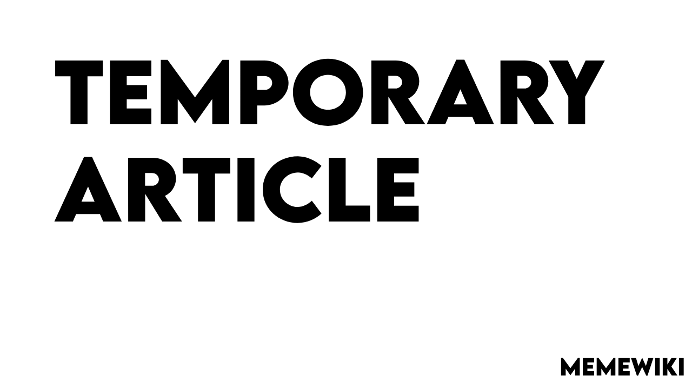

# 🛠️ Contributing

A contributing guide for MemeWiki.

 This guide will teach you how to
contribute articles for MemeWiki.

# 🟩 How do I contribute to MemeWiki?
## 📃 First of all, to contribute there are some requirements:
> 💻 Knowledge on HTML, CSS (js not necessary)

> 🖱️ Have a basic understanding on Photopea

> 🧑‍💻 Must know the basics of VSCode and Git

> ✏️ Good article writing skills :D

✅ If you passed these requirements, dm me on Discord. My username is **alluxd**.
 

 

## 🖋️ Making banners with Photopea

 
 Click to expand

 

### An example of a banner, this uses the Lemonmilk font.

### 1. Visit photopea.com
### 2. Click on the 'New Project' button
### 3. Set the resolution to 1280x720
### 4. Add an image of the character/meme you're making an article on

  
 4.1: To remove the background of a meme: 

#### 1. Select your meme's layer

#### 2. Use the magic wand tool:

#### 3. Click on select subject

#### 4. Hit Ctrl + J (Command + J on MacOS)

#### 5. There should be two layers now, remove the one with the background by
selecting the layer and hit 'Delete' on your keyboard.

### This step is optional, don't worry if it doesn't work.

### 5. Double click the meme layer and go to stroke. Change it as you wish. (DONT MAKE IT UGLY)
### 6. Move it to the left or center.
### 7. Add text, make sure you use either of these fonts: Lemonmilk or Poppins

 7.1: Adding a font 

### 1. For Lemonmilk

#### Go to this link: https://www.dafont.com/lemon-milk.font
#### 2. Download the font, it should download as a .zip file.
#### 3. Extract the file into a folder (It can be named whatever you want)

### 2. For Poppins

#### 1. Go to this link: https://fonts.google.com/specimen/Poppins (You may have to sign in)
#### 2. Download the font, it should also be a .zip file.
#### 3. Extract the zip file into a folder.

### 3. Adding the font to Photopea

#### 1. Use the text tool
#### 2. Click on the fonts tab. (It should say "DejaVu Sans")
#### 3. Click on 'Load Font'
#### 4. A file explorer window should open. Find the folder where you extracted the font files in
#### 5. Select all the .ttf/.otf files and click Enter
#### 6. Wait  a bit, and then search the name of the font you added.

### 8. Add effects, change colors and make the text look good!

### 9. Once you're done, click on File>Export As>PNG, and save it to the images folder in the website directory

 

## 🧑‍💻 Forking and running the repository

 
Click to expand

#### 1. Open a folder in vscode.
#### 2. Click on "Terminal" in the top bar, and then "New Terminal"
#### 3. Type ``git clone https://github.com/alluxd/memewiki.git <folder name>`` (Replace "folder name" with the name of the directory). Then hit enter.
#### 4. Open the index.html in editing mode
#### 5. Make sure you have LiveServer installed in VSCode extensions.
#### 6. Click on "Go Live", it should open in a chrome window

 

## 🖱️ Editing Articles

 
Click to expand

WIP

## ➕ Adding files to the github repo

 
Click to expand

WIP

